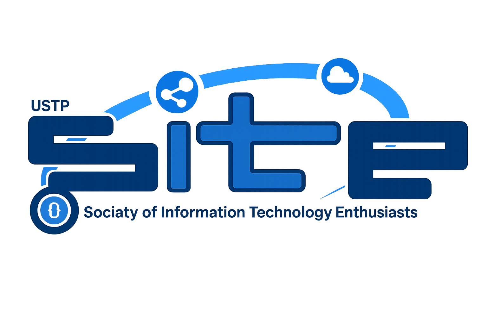

<div align="center">
  
  <h1>SITE USTP Website</h1>
  
  <p>
    <strong>The Official Digital Hub for the Society of Information Technology Enthusiasts (SITE)</strong>
  </p>

  <p>
    <a href="https://astro.build"></a>
    <a href="https://www.typescriptlang.org/"></a>
    <a href="https://tailwindcss.com/"></a>
    <a href="https://firebase.google.com/"></a>
    <a href="https://cloudinary.com/"></a>
    <a href="https://vercel.com/"></a>
  </p>

  <br />

  <p align="center">
    "A centralized, sustainable digital infrastructure enhancing information accessibility for all SITE students."
  </p>
</div>

<br />

> [!IMPORTANT]
> This project is currently in active development. Features and architecture are subject to improvements.

## 📖 Project Overview

The **SITE USTP Website** serves as the central digital platform for the Society of Information Technology Enthusiasts. It addresses the need for a unified information hub, streamlining organizational operations and transitioning towards a paperless model.

Aligned with **SDG 4, 9, and 12**, this platform is not just a website but a testament to the technical competence of the students, leveraging modern web technologies to create equitable access to resources, announcements, and transparency reports.

## 🛠️ Tech Stack

This project is built using a modern, serverless-first architecture to ensure performance, scalability, and maintainability.

| Category | Technology | Usage |
|----------|------------|-------|
| **Core Framework** | [Astro](https://astro.build) | Static Site Generation (SSG) & Server-Side Rendering (SSR) |
| **Language** | [TypeScript](https://www.typescriptlang.org/) | Type safety and robust logic |
| **Styling** | [Tailwind CSS](https://tailwindcss.com/) | Utility-first responsive design |
| **Backend & Auth** | [Firebase](https://firebase.google.com/) | Authentication (Google OAuth), Firestore (NoSQL DB) |
| **Media Storage** | [Cloudinary](https://cloudinary.com/) | Optimized image hosting and transformation |
| **Deployment** | [Vercel](https://vercel.com/) | Serverless functions and edge hosting |

## ✨ Key Features

### 🏛️ Information Hub
- **Landing Page**: Dynamic announcements and event teasers.
- **Officers Page**: Real-time roster of officers with dynamic profile pictures fetched from Firestore.

### 🔐 Admin Portal
- **Secure Login**: Google Sign-In integration via Firebase Auth using authorized institutional emails.
- **Role-Based Access**: Strict access control for administrative features.
- **Officer Manager**: Dedicated dashboard for updating officer details and uploading profile pictures.

### ☁️ Efficient Media Handling
- **Serverless Uploads**: Internal Astro API route (`/api/upload`) streams uploads directly to Cloudinary.
- **Auto-Optimization**: Assets are served via Cloudinary's CDN for optimal performance.

## 🏗️ Architecture

The application uses **Astro** in **SSR (Server)** mode, hosted on **Vercel**.

1.  **Client**: Requests pages. Static content is pre-rendered or fast-served; dynamic content (Admin areas) is rendered on-demand.
2.  **Serverless API**: The `/api/upload` endpoint runs as a Vercel Serverless Function, accepting file uploads and streaming them to Cloudinary.
3.  **Database**: Metadata (Officer mappings, text content) is stored in **Firebase Firestore**.
4.  **Identity**: User sessions are managed via **Firebase Authentication**.

## 🚀 Getting Started

### Prerequisites
- Node.js (v18+)
- npm or pnpm

### Installation

1.  **Clone the repository**
    ```bash
    git clone https://github.com/davenarchives/SITE-USTP-Website.git
    cd SITE-USTP-Website
    ```

2.  **Install dependencies**
    ```bash
    npm install
    ```

3.  **Configure Environment**
    Create a `.env` file in the root directory with your keys:
    ```env
    # Firebase
    PUBLIC_FIREBASE_API_KEY=your_key
    PUBLIC_FIREBASE_AUTH_DOMAIN=your_project.firebaseapp.com
    PUBLIC_FIREBASE_PROJECT_ID=your_project
    # ... other firebase config

    # Cloudinary
    CLOUDINARY_CLOUD_NAME=your_cloud_name
    CLOUDINARY_API_KEY=your_key
    CLOUDINARY_API_SECRET=your_secret

    # Admin
    ADMIN_EMAILS=admin@ustp.edu.ph,president@site.org
    ```

4.  **Run Development Server**
    ```bash
    npm run dev
    ```

## 📄 License

This project is licensed under the **MIT License**.

Copyright (c) 2026 SITE USTP

Permission is hereby granted, free of charge, to any person obtaining a copy of this software and associated documentation files (the "Software"), to deal in the Software without restriction, including without limitation the rights to use, copy, modify, merge, publish, distribute, sublicense, and/or sell copies of the Software, and to permit persons to whom the Software is furnished to do so, subject to the following conditions:

The above copyright notice and this permission notice shall be included in all copies or substantial portions of the Software.

THE SOFTWARE IS PROVIDED "AS IS", WITHOUT WARRANTY OF ANY KIND, EXPRESS OR IMPLIED, INCLUDING BUT NOT LIMITED TO THE WARRANTIES OF MERCHANTABILITY, FITNESS FOR A PARTICULAR PURPOSE AND NONINFRINGEMENT. IN NO EVENT SHALL THE AUTHORS OR COPYRIGHT HOLDERS BE LIABLE FOR ANY CLAIM, DAMAGES OR OTHER LIABILITY, WHETHER IN AN ACTION OF CONTRACT, TORT OR OTHERWISE, ARISING FROM, OUT OF OR IN CONNECTION WITH THE SOFTWARE OR THE USE OR OTHER DEALINGS IN THE SOFTWARE.
